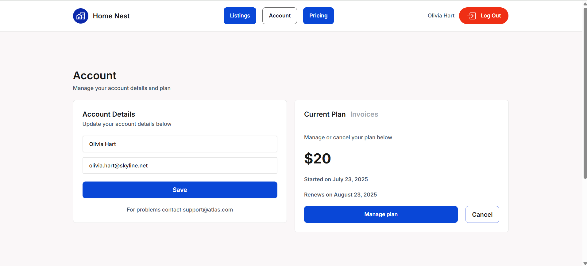

# bubble-api-workflows-stripe-airtable
Bubble.io app showcasing integrations of Bubble with Stripe for subscription payment and Bubble with Airtable for fetching live data from Airtable base

# Bubble Property Subscription App
A no-code web application built on Bubble.io demonstrating **Stripe subscription workflows** and **Airtable base integration** using custom API calls.

---

🔧 Features

- User login/signup flow
- Tiered pricing page with 3 subscription plans
- Stripe Checkout integration (via API Connector)
- Post-payment user redirection and access gating
- Account page with current plan, personal details, and invoice display
- Cancel subscription functionality via API
- Listings page displaying data from Airtable base which stores information regarding property listing (name, description, price, size, type, location)
- Create and edit property listings from Bubble

---

## API Integrations

### Stripe API
- Create Checkout Session
- Retrieve Subscription
- Retrieve Invoice
- Cancel Subscription

### Airtable API
- Retrieve property listings data from base
- Send records to Bubble and display on page
- Edit/Create property listings

---

## Tech Stack
- [Bubble.io](https://bubble.io/)
- [Stripe API](https://stripe.com/docs/api)
- [Airtable API](https://airtable.com/api)

---

## Screenshots

---

## Demo App Link

*(Optional: Add Bubble live demo URL if public)*

---

## License
This project is for portfolio and learning purposes. Not for commercial reuse.

---

## Author
Created by Nachiket Karhade
